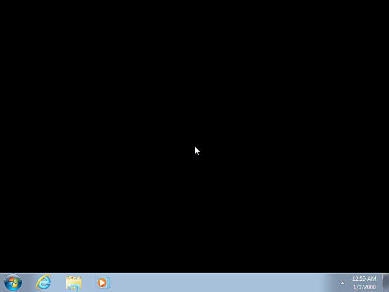

# The Windows 7 bring-up

> **Historical — the as-built record.** What it took to get an unmodified
> Windows 7 SP1 x64 guest from a firmware crash three thousand instructions in,
> to a reproduced interactive desktop. Every defect below is fixed and carries a
> regression test; this page is the catalogue and the narrative, not a statement
> of current state. For where the project stands now, see
> [../state/repo-state-and-structure.md](../state/repo-state-and-structure.md).
> For the instruments and method used throughout, see
> [../areas/debugging.md](../areas/debugging.md).

## Why this record exists

Every defect here was found by a guest doing something entirely ordinary that
the emulator got subtly wrong. None was found by reading code, and almost none
was guessable in advance. The catalogue is therefore useful in a specific way: it
is a list of the places where a plausible-looking x86 implementation diverges
from the architecture in ways that only a real operating system notices.

Two patterns run through the whole list, and they are worth stating before the
detail:

**The guest is never wrong.** Every single entry began as "Windows is doing
something strange" and ended as an emulator defect. That prior is worth holding
firmly, because several investigations lost time to the alternative.

**Fix with a witness.** Where a fix was tempting but unwitnessed, it was left
undone deliberately. The non-temporal SSE stores are the clearest case: `Movnti`
was implemented because the kernel's memcpy actually executed it, while
`Movntdq`/`Movntps`/`Movntpd`/`Movntdqa` were left alone because they have
alignment requirements the boot had not yet exercised. Implementing what you
guess a guest might need produces untested code that looks like coverage.

## The catalogue

Most of these are in the Tier-0 interpreter or the assist layer of
`aero-cpu-core`, and where a regression test is named it lives under
`crates/aero-cpu-core/tests/` unless said otherwise. The later entries name fewer
tests than the earlier ones — not because they lack coverage, but because the
source record stopped naming them; two that it did name are
`iretq_long_mode_software_frame_without_bookkeeping` and, in `aero-mmu`,
`long_mode_not_present_prototype_pte_is_not_rsvd`. Numbered in the order found.

> **On counting.** Around forty-six root causes were closed with live guest proof
> — meaning the guest itself demonstrably got further afterwards, not merely that
> a test went green. The input-path corrections were deliberately **not** counted
> as closed even after their host-side rules were fixed and regression-tested,
> because the acceptance criterion was a visible change in a painted Setup dialog
> and that had not been observed. That is the right instinct, and it is worth
> imitating: a fix with a passing test and no guest-side evidence is a hypothesis
> with good hygiene.

The numbering below is the original discovery order, running 1–28. Defects found
after that point are grouped by class in the next section rather than numbered,
because by then the interesting thing about each one was the *category* of
mistake, not its position in a queue.

### Instruction semantics and operand shape

1. **`ENTER`/`LEAVE` frame setup** — mode-correct BP/EBP/RBP selection and stack
   semantics. This was the very first wall: the machine died on `InvalidOpcode`
   at 2,883 instructions, inside its own BIOS, on bytes `c8 26 00 00`.
   Test: `interp_enter_leave.rs`.
2. **`PUSHF`/`POPF` width** — `66 9c` and `66 9d` in 16-bit mode must push and
   pop four bytes, not two; the width comes from the operand-size prefix, not the
   mode. Test: `interp_pushf_width.rs`.
3. **`LES`/`LDS` far-pointer loads** — load offset and selector together from
   memory. Test: `interp_les_lds.rs`.
4. **Far indirect `jmp`/`call` through memory far pointers**, plus real-mode far
   call and `retf`. Test: `interp_far_branches.rs`.
5. **`RETFD` operand size in protected mode** (`assist.rs`, `instr_retf`). The
   assist derived the far-return pop width from `state.bitness()` — the code
   segment default — instead of from the decoded operand size. So `66 cb` in a
   16-bit protected-mode code segment popped a 16-bit offset and selector out of
   a 32-bit frame, splitting `0x401000` into `off=0x1000, cs=0x40` and
   "returning" into a TSS selector. This is the exact instruction the Windows 7
   boot loader uses to enter 32-bit mode. Fix: derive the width from
   `instr.code()` (`Retfd`→4, `Retfq`→8, else 2), matching the real-mode path.
   Test: `interp_retf_width.rs`.
6. **`MemorySize::*Offset` rejected for indirect branches** (`ops_data.rs`,
   `mem_bits`). iced-x86 reports the memory operand of a near-indirect branch
   (`FF /4`, `FF /2`) as `DwordOffset`/`WordOffset`/`QwordOffset`, not `UInt32`.
   `mem_bits` accepted only the `Int`/`UInt` family, so it raised `#UD` on every
   jump-table dispatch — `jmp [eax*4+table]`, which is to say on most compiled
   `switch` statements. Test: `interp_indirect_branch.rs`.
10. **`Movsxd` (`0x63`) unimplemented** (`ops_data.rs`). Only `Movsx` and `Movzx`
    were handled; iced decodes `48 63` as the distinct `Movsxd` — sign-extend
    dword to qword, 64-bit only — which fell through to `#UD`. The x64 kernel
    uses it constantly. Note that only `Movzx` zero-extends; the fix
    sign-extends. Test: `interp_movsxd.rs`.
12. **The `PREFETCH` and reserved-NOP family unimplemented** (`ops_cf.rs`). Only
    `Nop` and `Pause` were handled, so `0F 18 /0-3`, `0F 0D`, and the reserved
    NOP encodings all raised `#UD`. The kernel's prefetching memcpy loop hit this
    26 million instructions past the previous wall. These are architecturally
    non-faulting hints — the memory operand is never dereferenced and bad
    addresses are ignored — so executing them as NOPs is correct rather than a
    shortcut. Test: `interp_prefetch_hints.rs`.
13. **`Movnti` (`0F C3`) unimplemented** (`ops_data.rs`). Architecturally a plain
    32/64-bit store: the non-temporal hint is not architectural state and carries
    no alignment or ordering requirement. Same kernel memcpy family as the
    previous entry, 163 instructions later. Test: `interp_movnti.rs`.

**Operand size versus mode, a third time.** After Setup finished and the machine
rebooted into the installed system, it hung immediately in the Windows master
boot record: `66 60` — `PUSHAD` with an operand-size override in 16-bit real mode
— raised `#UD`. Tier-0 was selecting the push width from the mode rather than
from the decoded mnemonic, exactly as it had for the far return and for
`PUSHF`/`POPF`. `LAHF`/`SAHF` were missing from the same path, and the boot
record needs them: it preserves the carry flag across an `add sp,10h` to know
whether the INT 13h read succeeded.

Nothing in this record reaches the installed system without that fix. Tests:
`interp_pushad_width.rs`, `interp_lahf_sahf.rs`, and an end-to-end
`windows_mbr_pushad_int13.rs`.

**A decoder's mnemonic set is not the instruction set.** `SYSRET` with a REX.W
prefix (`48 0F 07`) decodes as a *distinct* mnemonic, `Sysretq`, and only the
un-prefixed `Sysret` was routed to the assist — so the 64-bit kernel exit raised
`#UD`. The fault landed between `SWAPGS` and the return, leaving user `GS` active
in kernel context, so the next kernel entry faulted on that, and the machine
triple-faulted. The same fix tightened `SYSCALL`/`SYSRET` to load the
architecturally fixed segment descriptor caches and to mask flags as
`(R11 & 0x3C7FD7) | 2`. Test: `sysretq_assist.rs`.

Entries 6 and 10 are the same shape. Whenever an instruction has operand-size or
REX variants, check that *every* mnemonic the decoder can emit is routed, not
just the canonical one — a missing route surfaces as a `#UD` a long way from the
real problem.

### Ordering and side effects

11. **Near indirect `CALL` pushed the return address before reading its target**
    (`ops_cf.rs`). The implementation did `push(next_ip)` and then
    `branch_target()`, so for a memory-indirect call whose effective address
    involves the stack pointer — `call [rsp+disp]` — the address was computed
    against the *already decremented* `rsp`, fetching the target one slot low.
    Intel orders it the other way: read the target, then push. The boot loader's
    import-thunk dispatch `call qword ptr [rsp+0x80]` therefore read `[rsp+0x78]`,
    got a spilled argument pointer, and called into a data page.

    A sibling audit was done rather than assumed: `push r/m` and the far-call
    paths already read their operand first, `jmp r/m` pushes nothing, and
    memory-indirect far calls in protected and long mode error rather than
    mis-execute. Test: `interp_call_rsp_operand.rs`, with a decoy value one slot
    low in each of three addressing forms.

### Segmentation and mode transitions

7. **Stack address size taken from CS.D instead of SS.B** (`state.rs`,
   `stack_ptr_reg`/`stack_ptr_bits`) — the deepest defect of the bring-up. These
   derived the stack width from `bitness()`, the **CS** D flag, instead of the
   **SS** B flag the Intel SDM mandates. In 16-bit protected mode with a 32-bit
   stack segment — CS.D=0, SS.B=1, exactly the shape of the boot stub
   mid-transition — every push, pop, call and return masked the stack pointer to
   16 bits. A 16-bit `push edx` that should have written `0x61ff8` went to
   `0x1ff8`.

   What made this expensive is that it was *invisible in a register dump*: only
   the low 16 bits are written, so `RSP` still displayed `0x61ff8`. Fix: a new
   `stack_addr_bits()` keyed off `segments.ss.is_default_32bit()` in protected
   mode. Test: `interp_stack_addr_size.rs`.
8. **Null SS selector rejected in 64-bit long mode** (`segmentation.rs`,
   `load_seg_protected`). The null-selector path raised `#GP` for `Seg::SS`
   unconditionally, but per the SDM, loading SS with a null selector is *allowed*
   in 64-bit operation — SS base and limit are ignored there — and faults only in
   legacy protected mode. The kernel executes `mov ss,ax` with AX=0 at its
   long-mode entry. `seg_base_reg` already forces the SS base to zero in long
   mode and stack operations do not consult SS usability, so the fix marks it
   unusable and returns success, in long mode only. Test: `long_mode_null_ss.rs`.
9. **Compatibility-mode far transfer rejected** (`segmentation.rs`,
   `validate_load_cs`). A shortcut commented "simplified model" raised `#GP` on
   any far transfer to a legacy (L=0) code segment while in long mode. That
   transfer is legal and enters **compatibility mode**, which is what the boot
   does with a `retfq` to a 32-bit code segment. Removing the shortcut is
   sufficient because the MMU keys 4-level paging off CR4.PAE and EFER.LME rather
   than off CS.L, so long-mode paging correctly survives the transition.
   Test: `long_mode_compat.rs`.

### Model-specific registers and CPU identification

15. **`RDMSR` of `IA32_MISC_ENABLE` (`0x1A0`) raised `#GP`** — the read handler
    faulted on unknown MSRs. It now returns `0x111889` — fast-string, TM1,
    performance monitoring, branch-trace-storage and PEBS reported unavailable,
    and both Enhanced SpeedStep bits (`crates/aero-cpu-core/src/msr.rs`).
16. **`WRMSR` of `IA32_BIOS_SIGN_ID` (`0x8B`) raised `#GP`** — surfaced
    immediately after the previous fix. Reads return zero and writes are
    accepted. Both live in `crates/aero-cpu-core/src/msr.rs`.
17. **CPUID leaf 1 EDX was missing features Windows requires.** A feature probe
    masks `CPUID.1:EDX` with `0x0789F3FD` and compares for equality; the
    advertised set was missing DE, PSE, MCE, MTRR, PGE, MCA, PAT and CLFSH, so
    the comparison failed and the kernel called
    `KeBugCheckEx(UNSUPPORTED_PROCESSOR)` before initialising the system service
    table at all. Every downstream symptom — a livelock dispatching service
    `0x12F` against an empty descriptor table — was fallout from a Phase-0 abort,
    not a separate defect. Fix: expand `CpuFeatureSet::win7_minimum()` and pin the
    mask as `WIN7_REQUIRED_LEAF1_EDX` with a regression test.
19. **`RDMSR` of `IA32_PLATFORM_ID` (`0x17`) raised `#GP`** — stubbed, along with
    `FEATURE_CONTROL`, `DEBUGCTL`, and the MTRR, PAT and MCA ranges.

### Privileged and system instructions

18. **`WBINVD` (`0F 09`) raised `#UD`** — implemented as a CPL0 no-op in both the
    assist and the Tier-0 privileged path.
20. **`#GP` on `movaps` inside an `INT3` trap frame.** The IA-32e interrupt frame
    was pushed without aligning RSP to 16 bytes first, so the handler's aligned
    SSE spill faulted. Fix: align RSP to 16 bytes before pushing the frame.

### Interrupt delivery, trap frames and paging

These cluster because they were found in sequence, each one uncovered by fixing
the last, as the kernel got further into its own initialisation.

21. **The HAL's initialisation wait could never succeed.** After the service
    table was populated the kernel sat in a HAL loop with interrupts disabled,
    which looks exactly like normal boot idle and is not: mapping the address to
    the nearest export and dumping `KiBugCheckData` proved it was
    `KeEnterKernelDebugger` following `KeBugCheckEx(0x5C, …)` —
    `HAL_INITIALIZATION_FAILED`.

    The wait succeeds only when the clock interrupt handler increments a flag.
    With interrupts disabled, and with the `RDTSC` assist leaping past the
    deadline *inside a single CPU batch* before the platform timers had a chance
    to tick, the flag could never move. This is the first entry where the defect
    was in the emulator's *timekeeping* rather than its instruction semantics.
    Fixes: `Machine::run_slice` now advances platform time from the TSC delta
    rather than from retired instruction count alone, and the batch quantum was
    reduced. See also the read-side clock nudges in the debt list, which are the
    unfinished part of the same problem.
22. **Architectural faults were not delivered through the guest IDT.** Page
    faults now dispatch via the guest's interrupt descriptor table like any other
    exception.
23. **Long-mode interrupt frames omitted SS:RSP for same-privilege faults.** The
    frame was built as 32 bytes; in IA-32e it is always 48 bytes with SS and RSP
    pushed regardless of privilege change. The short frame corrupted every trap
    frame the kernel then tried to read.
24. **`MOVNTDQ` unimplemented** — the SSE2 non-temporal store, implemented once
    the boot actually executed it. This is the sequel to the deliberate omission
    noted above: it was left out while unwitnessed, and added when witnessed,
    which is the principle working rather than failing.
25. **Read-modify-write operations did not signal write intent.** Non-`LOCK`
    memory `OR`/`AND`/`ADD` and friends translated as reads, so a page fault
    raised during one reported `error_code.W/R = 0`. The guest uses that bit to
    decide whether a fault is a write, which matters for copy-on-write and for
    dirty-bit accounting. Verified afterwards by observing `err=0x2` on a
    hyperspace bitmap touch.
26. **Software `IRETQ` raised `#GP(0)` in long mode** when the emulator's
    interrupt-frame stack was empty. The kernel builds interrupt frames in
    software and returns through them — `KiExceptionExit` does exactly this — so
    an empty internal stack is normal, not an error.
27. **Page-table AVL bits 52–62 were treated as reserved.** Those bits are
    software-available, and Windows 7 uses bit 59. Treating them as reserved
    turned ordinary page-table entries into faults, producing a soft-fault
    livelock.
28. **`MOV CR8` did not update the local APIC task-priority register.** CR8 *is*
    the TPR in 64-bit mode; not wiring it meant interrupt prioritisation silently
    did nothing, which showed up as a deferred-procedure-call spinlock hang.

### Firmware

14. **The RSDP was not duplicated into the F-segment** (`firmware/src/bios/post.rs`).
    The BIOS placed the Root System Description Pointer in the EBDA at `0x9F100`
    and nowhere else. Windows `bootmgr` scans the F-segment (`0xE0000`–`0xFFFFF`)
    for the `"RSD PTR "` signature and, not finding it, concludes "BIOS is not
    ACPI compatible" — error `0xc0000225` — without ever reading the EBDA, the
    ACPI tables, or calling the PCI BIOS.

    This is the entry that best illustrates the value of proving a *negative*.
    Three hypotheses about table placement and content were exonerated first, and
    what finally located the defect was a read watchpoint recording **zero** hits
    on the ACPI tables across a 4.67-billion-instruction boot: the guest was not
    rejecting the tables, it had never looked at them. Real BIOSes keep an RSDP
    copy in the F-segment precisely for this. Fix: copy the 36-byte RSDP there
    during POST, after building the tables. A cold boot then ran past 7.3 billion
    instructions and reached the kernel at high-half addresses.

## The deeper classes

Past the kernel handoff the defects stop being individual missing instructions
and start being *models that were wrong*. Each of the following is a class, and
each cost more than any single opcode.

### Advertised features must actually exist

This is the single most repeated defect in the record — **at least eight
separate occasions**, and it kept recurring right up to the last stretch before
the desktop:

| Missing | Found by |
|---|---|
| `COMISD` / `UCOMISD` / `COMISS` / `UCOMISS` | a `SYSTEM_SERVICE_EXCEPTION` in the window manager |
| `CVTDQ2PD`, `CVTPD2DQ`, `CVTTPD2DQ` | a triple fault on the cold boot loader |
| `CVTDQ2PS` | the wall immediately after the `LSL` fix |
| `CVTPS2PD` / `CVTPD2PS` | a bugcheck once the pre-install shell started |
| `XORPD`, `ANDPD`, `ORPD`, `ANDNPD`, `MOVAPD`, `MOVUPD` | the same stretch |
| `PUNPCKLQDQ` / `PUNPCKHQDQ` | `services.exe` dying with an illegal-instruction status, faulting inside the database engine |
| **`CVTSD2SS` / `CVTSS2SD`** | `LogonUI` crash-looping, `spoolsv` dying, and the out-of-box setup process faulting inside the imaging library |
| `SQRTSD`, the x87 transcendentals (`FYL2X`, `F2XM1`, `FRNDINT`, `FSCALE`, `FSQRT`), `MOVLPD`/`MOVHPD` | a first-logon process that looked hung and was actually taking `#UD` |

Every one was an instruction the CPUID leaves already claimed to support.
Windows and its C runtime simply use what is advertised.

The scalar-versus-packed pair deserves singling out, because it is the trap that
caught this project twice. `CVTPS2PD` and `CVTPD2PS` — the *packed* forms of
`0F 5A` — were implemented; the *scalar* forms `CVTSD2SS` (`F2 0F 5A`) and
`CVTSS2SD` (`F3 0F 5A`) were not, and only the prefix distinguishes them.
Implementing one form of an opcode is not implementing the opcode. Both scalar
converts also have merge semantics — `CVTSD2SS` replaces only the low 32 bits of
the destination, `CVTSS2SD` only the low 64 — so the regression executes the
exact guest encoding and asserts the upper bits survive
(`cvtsd2ss_guest_logonui_encoding_preserves_dest_high`).

The lesson is stated plainly because it was learned five times: **auditing CPUID
against the actually-implemented opcode set would have pre-empted all of them.**
Each was found the slow way instead, through a different guest symptom —
`SYSTEM_SERVICE_EXCEPTION`, an unhandled exception in the session manager, a
service dying with an illegal-instruction status.

`MOVLPD` deserves a specific note: it must **preserve the upper 64 bits of the
destination register**, which is why it has a dedicated test rather than sharing
one.

`LSL` (`0F 03`) belongs to the same family but is not SSE — its absence killed
the session manager, and it was pinned by the `#UD` logger. That logger only
became usable once it stopped firing on page faults: **a diagnostic that triggers
on the common case is useless**, so filter it to the rare case before trusting
it.

### An instruction that faults must leave no trace

A `CALL` whose return-address push crossed onto an unmapped stack page committed
the stack-pointer decrement *before* the store. The store then faulted, the guest
grew the stack and restarted the instruction — and the push happened twice, so
the stack pointer ended up off by one slot.

x86 requires faulting instructions to be **restartable**: no architectural side
effect may be committed before the memory access that can fault. The fix commits
the stack pointer only after a successful store, in `push`, `push_sized` and the
interrupt frame pushes alike.

What makes this entry worth reading is the distance between the defect and the
symptom. The visible failure was the session manager dying with a stack-cookie
violation. The cookie check was the *detector*, three layers above the bug; the
crash reporter and its status codes were noise.

### Model the event, not the state

Three separate defects share one root: treating an architectural operation as a
*state difference* rather than as an *event*.

**Reloading the same page-table base must still flush translations.** The
synchronisation path only acted when the register's bits changed, so a same-value
`MOV CR3` — which x86 defines as a valid way to invalidate non-global cached
translations, and which Windows relies on here — did nothing. The guest then
reached a freed object through a stale translation. The sequence was pinned to
four instructions: the page-table entry was cleared, the same value was written
to the register, the entry became a transition value, and a store landed on the
old object anyway. The fix separates the write *event* from state synchronisation
so the event fires even when the value is unchanged.

Note what this defect had previously been diagnosed as: a corrupt handle table,
"fixed" with a memory poke that zeroed the offending entry. **A corrupt structure
is very often a correct structure read through a stale translation** — ask
whether the *view* is wrong before patching the data.

**Writes to the timestamp counter are not elapsed time.** Elapsed platform
cycles were computed by subtracting the counter before a batch from the counter
after. Windows deliberately *resets* that counter immediately before calibrating
it, and that legal backward write looked like nearly 2^64 cycles of elapsed work,
wrapping the power-management timer backwards. The counter is guest-writable, so
elapsed emulator work may never be inferred from it: the fix keeps a monotonic
cycle count that the guest cannot touch, separate from the architectural value
the guest observes.

**A device register the guest never writes may still need resetting.** On the
disabled-to-enabled transition, the display device is required to zero its
virtual width and offsets. Windows correctly omits that write because the
hardware is obliged to do it. Aero kept a stale virtual width from the earlier
boot mode, so the guest wrote 3,200-byte rows while presentation sampled
4,096-byte ones. When the guest omits a write, ask whether the hardware is
*required* to reset it — omission is usually reliance on a device-side rule.
Pitch bugs are also self-identifying once seen: horizontal banding, vertical
drift, and surviving content from the previous mode.

### One clock, shared by every device

The power-management timer had a "poll nudge": every guest *read* advanced that
device's own private time base by 100 microseconds. A tight polling loop
therefore saw power-management time racing ahead while the timestamp counter and
every other timer stood still.

Windows calibrated the timestamp counter against that artificially fast timer and
stored the result: 14.08 MHz, against a real 3 GHz. From then on every deadline
the kernel computed was wrong by a factor of over two hundred, and a three-second
wait expired in fourteen milliseconds — shorter than the tick period of the clock
it was waiting on, so the wait could never be won.

**A per-device private clock is a correctness bug even when it looks like a
harmless optimisation.** Every timekeeping device must sample one shared base,
because the guest can *calibrate one against another*, and any divergence becomes
a poisoned constant far from the mutation site. Acceleration is still available,
but as an explicit opt-in that advances *every* clock coherently from the same
delta.

The honest cost of correctness was recorded too: a 109-millisecond calibration
interval takes about 327 million retired instructions and 75 seconds of host
time.

### The platform is a contract, and silence is part of it

**What the platform advertises determines what the OS is allowed to do.** The
firmware publishes no interrupt-mode-control capability, and the Intel
multiprocessor specification says that on such a platform the operating system
enables the interrupt controller's entries and no other transition is required.
Windows therefore correctly never performed the transition write — and the
emulator sat waiting for a write that a conforming guest must not make, leaving
the timer routed to a masked legacy controller. The fix enters symmetric
interrupt mode as soon as any redirection entry is unmasked.

Note that the same bugcheck code, with the same subtype, was produced by *two
entirely different* root causes on two different lineages — this routing defect
and the clock-calibration defect above. **A bugcheck code is not an identity.**

**Interrupt routing that is internally consistent can still be wrong.** The
default routed the four PCI interrupt pins onto interrupt lines 10–13, which put
a storage controller on line 12 — the line the PS/2 mouse claims. The firmware
tables, the device configuration, the runtime router and the polarity model all
agreed with each other, because all four derived from the same wrong constant, so
no local test could catch it. Ground truth put the PCI pins on lines 20–23 and
kept 1 and 12 for keyboard and mouse. A second, independent bug hid in the same
place: the polarity table still classified those lines as active-low, which would
have made a real mouse interrupt look deasserted. The mapping now has exactly one
home that every consumer derives from, and the regression exercises assertion
*and* deassertion, because a test that only checks a stored flag cannot catch an
inversion.

**Debug the parent before the child.** The mouse's resource conflict was not
about the mouse. The PCI root itself was failing resource assignment and had
enumerated no children at all, because the firmware published the system timer,
real-time clock and reset registers as *siblings* of the PCI root while their
fixed port claims lay *inside* the root's producer windows — and one of them
claimed a port inside the root's own configuration window. The producer/consumer
hierarchy is load-bearing, not cosmetic. Moving those devices beneath the bridge
where the reference platform puts them took the device tree from 77 nodes with a
broken root to 85 nodes with keyboard and mouse both started, both interrupt
lines unmasked, and the guest genuinely reading and writing the controller ports.

### Emulating a multiprocessor design on one processor

Windows' thread dispatcher is written for real multiprocessor hardware, and two
of its assumptions do not hold when only one processor is ever modelled.

**Cross-processor handshakes never complete.** A thread spun on
`pause; cmp byte [rsi+0x49], 0` — a flag meaning "this thread is still running on
some other processor", which the outgoing processor clears once its context
switch finishes. With no other processor, the flag stays set forever and the
dispatcher deadlocks. The interpreter now recognises that spin and clears the
stale flag. It deliberately *declines* to do so when the spinning thread is the
current one, because there the flag is truthful.

**Timekeeping only at slice boundaries is a bug.** A kernel loop containing no
halt and no timestamp read can occupy an entire scheduling slice, starving every
other thread; a security-processor driver did exactly that. Waiter ticks now also
fire every million retired instructions *inside* a long slice. The limitation is
recorded honestly: this wakes delay-based waits, and does **not** wake a thread
blocked in a message loop or an indefinite wait.

Declining to clear the flag for the current thread left the interpreter
single-stepping a four-instruction spin at full dispatch cost, so that loop is
now pattern-matched and batched — **5.64 to 134 million instructions per second**,
about twenty-four times faster, on the same checkpoint. The constraint on any such
helper is that it be *observationally equivalent* to single-stepping: same retire
count, same flags, same resulting instruction pointer, same side effects. It must
also not bail out merely because a masked interrupt is queued — that specific
bail-out has been a recurring bug shape, which is why each helper carries a test
for it.

Several of these helpers exist by now: the dispatcher spin above, a SHA-512
compression round, a string-uppercase routine, the decompressor's match-copy and
bit-refill loops, its byte scanner, and a kernel name hash. Each is oracled
against single-stepping.

**A matcher that is too generic corrupts guest memory.** The SHA-512 helper
originally identified its target by eighteen bytes of what turned out to be a
*generic* 64-bit function prologue. It matched a different routine entirely,
wrote 64 bytes through a register that meant something else there, and returned —
surfacing much later as a `MEMORY_MANAGEMENT` bugcheck with no visible connection
to the fuse. The matcher now requires the full 32-byte prefix including the
stack adjustment. This is why pattern-based fusion needs a **negative** oracle —
sequences that must *not* match — and not only a positive one. The
still-unresolved livelock in the decompression fuses (see
[cpu-and-jit.md](../areas/cpu-and-jit.md)) is very likely the same shape.

One incidental finding worth keeping: the thread-state field on this kernel build
is at a different offset than the published structure databases give, and every
scheduler conclusion drawn from the wrong offset was unreliable. **Struct offsets
are per-build** — validate one against observed behaviour before reasoning on top
of it. A field that reads identically for every thread is the tell.

### Never do more than the architecture asks

Windows painted an application-error dialog naming a faulting instruction and the
address it supposedly could not write. The instruction was a complete two-byte
jump, sitting twelve bytes before the end of a mapped page. Tier-0 was fetching a
full fifteen-byte decode window, and the *next* page was not mapped — so the
emulator raised a page fault on bytes the instruction never needed, and reported
it as a write.

**Decoder lookahead is not an architectural access.** The fix fetches only the
current page, and requests the wider window only when the decoder actually
reports a truncated instruction.

This is a class, not an incident: any optimisation that reads *more* than the
architecture requires — prefetch windows, speculative loads, wide reads — can
manufacture faults real hardware never raises. The same class shows up twice more
below.

Worth noting how it was found: the guest's own error dialog named both the
faulting instruction pointer and the inaccessible address. **The guest's error
messages are free bug reports.** The same is true of its log files, which can be
read straight out of physical memory — the Setup log named an exact API, its
`HRESULT`, and its last-error code, collapsing what had been days of guesswork
about a stalled disk-service launch.

### An interrupt is an edge, not a level

The optical drive never appeared. The controller channels enumerated, the command
exchange on the wire looked correct, and the driver simply declined to publish a
device — which was read, for a while, as a driver policy decision.

It was a lost interrupt. Windows' ATAPI transfers raise **two** interrupts: one
when the data is ready, and a second at status. The device only pushed its line
during a poll that ran *between* execution batches, but port I/O is handled
inline — so a single batch could contain both the acknowledgement that should
drop the line and the transfer whose final word should raise it again. The poll
saw the line asserted at both ends and never produced the transition. The driver
was waiting for a second *delivery*, and got a second *level*.

**Level-triggered delivery is an edge history, not a level sample.** Sampling a
line only at batch boundaries erases every transition inside the batch. The fix
drives the pin from the assert and clear paths directly.

The general rule that came out of it: **when a guest driver appears to decline to
do something after a correct-looking exchange, suspect a lost interrupt edge
before suspecting driver policy.** Batched execution combined with inline I/O is
a structural hazard for anything polled at batch granularity.

### An idle guest still has to be woken

Windows idles in an *interruptible* halt, and four independent defects conspired
so that nothing ever woke it: the screen went black and the guest executed zero
further instructions for minutes of platform time.

- The runner treated **every halt as terminal**, ending the run rather than
  continuing to tick devices. A halted guest is not a finished guest.
- The I/O interrupt controller **dropped logical-destination entries** entirely.
  Windows programs the high-precision timer's line in logical mode, so its edges
  never reached the processor at all.
- The local controller's **logical-destination and format registers were not
  modelled** — writes were ignored. A sibling delivery path already implemented
  logical addressing, which is exactly what hid the gap: a feature implemented in
  one path masks its absence in another.
- The high-precision timer **only pulsed its edge on a clean status transition**,
  so periodic re-fires were suppressed while the guest had not yet cleared the
  status bit. Real hardware edges every period regardless.

The delivery model was completed the same way: logical-destination matching, and
lowest-priority delivery selecting one receiver by minimum priority class and
then by controller identity. Snapshot restore migrates older checkpoints that
already contain an enabled route. Tests live in
`crates/aero-interrupts/src/apic/io_apic.rs` and `crates/devices/`.

**"Zero instructions executed" is a device symptom, not a CPU symptom.** That is
the reusable part.

### Storage is a wire protocol, and the details are not negotiable

Three defects in the same area, each a case of assuming something the
specification does not say.

**A scatter-gather fragment is not a sector.** Formatting failed with a generic
invalid-argument error from a high-level API. The write was actually being issued
and *aborted at the device*: the guest split a single 512-byte sector across two
descriptor fragments of 100 and 412 bytes, and the disk model required every
transfer to be a multiple of the sector size. Descriptor entries are
byte-granular; the device must reassemble whole sectors across them. The fix
carries a read twin, because the same assumption is nearly always present on both
paths.

**A high-level error code can be a silently aborted transfer five layers down.**
That invalid-argument error had been attributed to a zero sector-size value, and
a great deal of effort went into poking five different caches to the "right"
values with no behavioural change at all. That is itself the signal: when
correcting every plausible input changes nothing, you are at the wrong layer.
What resolved it was turning the device trace up until the aborted writes were
visible.

**The high-order-byte register is a shadow of the previous value, not a
destination for the current one.** Aero's first write to a task-file register
went into the shadow and left the visible register unchanged, so a driver that
writes a byte-count limit and reads it back saw the wrong value. Reference
behaviour puts the new value in the register and the *previous* one in the
shadow.

Two adjacent lessons. A compatibility shim that had been added earlier to make an
error go away — a fabricated response to a page the reference implementation
rejects outright — was itself wrong and had to be reverted; **divergences from the
reference accumulate, and "make the error stop" fixes hide the protocol.** And
when a device model and the platform bus each hold a copy of PCI configuration
space, **find out which copy the guest actually reads**: a channel-enable bit was
set on the unread copy and had no effect at all. Snapshot restore is a third path
that must apply the same defaults as construction and reset.

### The fast path must be arithmetically identical to the slow one

Signature verification failed inside the guest. The certificate was fine, the
file was fine, and the arithmetic was correct — under the interpreter.

Two things isolated it. The failure was **size-dependent**: a 2048-bit
verification passed while a 4096-bit one produced a wrong-but-plausible number.
And the same snapshot run **with and without the compiled tier** gave different
answers. The cause was that Tier-1 did not decode add-with-carry and
subtract-with-borrow, so a big-number carry chain never compiled as one
consistent block.

**When an arithmetic or cryptographic result is wrong, run the same snapshot on
the slow path first.** If the two disagree, the bug is in your fast path — not in
the guest, the file, or the certificate. Cryptography is an ideal amplifier for
this: one wrong bit is a total failure rather than a subtle drift.

The same technique later found a second divergence of identical shape that is
**still unresolved** — see the debt list in
[../areas/cpu-and-jit.md](../areas/cpu-and-jit.md). Fixing one instance of a bug
class does not close the class, which is why the comparison harness is kept.

A related performance finding, from the same investigation: a single unsupported
opcode in a hot loop reduces compiled coverage of that loop to nothing, because
block formation is all-or-nothing. Rotates, byte-swap and bitwise-not were
missing, and a hashing inner loop was compiling *twenty-five instructions* out of
an eighty-million-instruction slice. The commonest gaps in real decompression and
crypto loops turned out to be the 8-bit arithmetic forms and shift-by-`CL`.

### Time must advance for a busy guest

Timed waits in the guest never expired: wall-clock advanced about a second per
several hundred million instructions. Platform time was only being advanced on
the idle path, which never ran while any thread stayed runnable.

**Guest timed waits are a liveness contract.** A busy guest must still observe
wall-clock advancing, or every timeout-based unblock stalls indefinitely. Waiter
ticks now advance platform time after a full slice of long-mode execution with
interrupts enabled.

**A device the firmware does not declare might as well not exist.** The keyboard
controller was fully modelled — ports, interrupts, snapshot state — and Windows
never touched it, because nothing advertised it. The fix is declaration, not
emulation: the boot-architecture flags must claim an 8042, and the namespace must
publish the standard keyboard and mouse identifiers at their conventional ports
and interrupt lines, gated by the same setting that enables the model itself. The
next legacy device that gets modelled without being declared will fail the same
silent way.

**One wrong bit in a mode table hides every mode.** The video BIOS reported its
mode attributes with the flags shifted by one position, so the graphics bit
landed where the specification puts something else. Every mode query *succeeded*
and every mode set *failed*, and Windows — behaving correctly — concluded there
were no graphics modes and stayed in text at 720×400. The asymmetry is the tell:
when a query succeeds and the corresponding set fails for *every* item, the bug
is in the content of the query, not in the setter.

### Firmware only works if the consumer executes it

The video BIOS entry point was implemented as a single halt instruction that the
host recognised and serviced — high-level emulation. Boot-time graphics worked
perfectly, which actively concealed the defect, because the boot path executes
those bytes on the emulated CPU.

Windows does not. Its hardware abstraction layer **copies the first megabyte and
software-interprets the BIOS image** with its own 16-bit interpreter. That
interpreter cannot dispatch a host hook, so every video call failed, and the
display driver mapped the failure to a generic error for every mode it tried.

**High-level emulation of a firmware entry point is only valid if every consumer
executes it as code.** The replacement is genuinely interpretable 16-bit code,
verified by disassembling the emitted ROM and checking every opcode it uses
against the consumer's own interpreter table.

That fix then exposed its own corollary. Replacing a high-level-emulated path
with real guest-executed code makes **every host-side cache that path used to
keep in sync stale by construction**: the interpreted ROM changed the display
mode registers correctly but could not call back into the host's private copy of
"current mode", and presentation still trusted the stale copy. Enumerate those
caches as part of any such migration.

## What the guest does unaided

Everything in the catalogue above is a real fix in the tree. The bring-up also
leaned heavily on **scaffolding** — memory pokes, stubbed kernel routines, forced
interrupt flags, injected keystrokes, skipped waits — and keeping the two apart
is the difference between an honest record and a flattering one.

The unscaffolded baseline is this. A plain cold boot of the install media, with
no pokes, no forced flags and no snapshot, walks the firmware, `bootmgr`, the VBE
mode switch and into long mode, and then makes clean forward progress until it
hits the time cap:

```
--install-iso <win7 iso> --ram 2048 --max-ms 600000
t=30s    Real       720x400
t=60s    Protected                            bootmgr
t=120s   Protected  1024x768  non_zero=28455  VBE graphics, "Windows is loading files"
t=360s   Long       cr3=0x187000              winload in long mode
t=570s   Long       2,946,700,000 insts       5.17 Minst/s sustained
```

No fault and no exception — it stops only because the budget runs out. That run
independently corroborates the VBE mode-attributes fix and the carry-flag fix,
and it prices the development loop. The run above is a ten-minute budget; a full
experiment — rebuild, boot, look — was measured at around **half an hour**, most
of it not the boot. That is why the workflow is snapshot-driven, and why losing a
snapshot lineage is expensive rather than merely annoying.

Beyond that point the record thins in places, and it is worth being exact about
why, because an earlier draft of this page overstated it. One body of evidence —
the captures and snapshots under a `/tmp` scratch directory — is genuinely gone,
and the findings that rested only on it are no longer checkable. The rule that
came out of that is in
[../meta/working-agreements.md](../meta/working-agreements.md).

But the *durable* evidence base survived and is substantial:
the boot-output tree still holds several hundred checkpoints, including the
complete no-poke cold lineage, the QEMU ground-truth captures, and both
purpose-built oracles with their recorded output. It is named here because it was
nearly lost a second way — by being findable from nowhere.

### The scaffolded shell, and why it was the wrong road

There was an extended push to reach a taskbar by force. It involved stubbing
kernel synchronisation routines, planting a fake object with a hand-built method
table so a crashed service would return, hijacking a stack return slot to jump
past a constructor, forcing thread priorities, poking the dispatcher's
next-thread field, short-circuiting the image decoder's per-pixel loops, and
registering a dummy class object to break a COM deadlock.

It did produce pixels. It was **not a naturally booted desktop**, and the record
is explicit about that: the window handle for the taskbar existed only because a
stub had jumped past the constructor and a hand-planted method table answered the
first message; the cursor moved only after the scheduler's next-thread field was
poked. Along the way the scaffolding manufactured at least two failures that were
then investigated as though they were real defects.

What that stretch *did* produce, and what survives, is the set of genuine
emulator fixes described above — the missing user-mode instructions, the
uniprocessor dispatcher fuses, mid-slice timekeeping — plus a set of hard-won
prohibitions:

- **Never poke the dispatcher's current-thread pointer.** It triple-faults.
- **Never force a thread ready when the dispatcher owns it.** A thread whose wait
  list points back at the processor control block is mid-transition; forcing it
  corrupts the dispatcher.
- **Never synthesise a mapping to satisfy a fault on pageable memory.** The
  correct move is to touch the page from a normal-priority context on the same
  thread and let the guest's own memory manager resolve it. Faking the mapping
  bypasses the guest's page bookkeeping and bugchecks.
- **Never return a synthetic error from an ownership-transferring wait**, as
  above.
- **Skipping a constructor buys a null pointer at the first virtual call.**
- **Never kill `winlogon`.** It is a critical process; terminating it bugchecks
  the guest with `CRITICAL_OBJECT_TERMINATION`.

The road that actually worked was the opposite one: fix the emulator until the
guest does it by itself — and, where the *guest image* was genuinely
misconfigured, fix that offline rather than papering over it at runtime. The
image had been installed with an answer file that requested an automatic logon
and skipped user setup, so no enabled account existed at all and the logon UI had
nothing to display. `tools/win7-bringup/configure-autologon.py` applies what the
installer should have, by editing the registry hives directly. The clearest illustration is a script written to
neutralise a first-logon step that appeared to hang forever — it was **kept, and
never used**, because once time accounting was honest that step completed on its
own. Nothing had to be neutered.

That is the general shape of this whole record. Every wall that was worked
*around* came back; every wall that was worked *through* stayed closed.

### What it looks like

Two captures, because "the taskbar exists" and "the desktop is rendered" are
different milestones and conflating them is exactly how a bring-up flatters
itself. First the taskbar's first paint, with the desktop still black:



Then the complete desktop — wallpaper, Recycle Bin, taskbar, tray clock:


Both are 800×600×32 from the native runner. The guest clock reads `1/1/2000`
because guest wall-clock time is not set from the host.

## Two worked examples

### The six-hop chain, and why forward divergence exists

The symptom was six levels removed from the cause, and the chain is worth
following because it is the argument for the diffing strategy in
[../areas/debugging.md](../areas/debugging.md).

At 20,376,885 instructions the loader executed `mov eax,[0x495e08]; call [eax]`
with `eax = 0`, calling through the interrupt vector table and raising `#UD`.
Under QEMU the same instruction targeted a protected-to-real-mode BIOS thunk.
Each of the following was *established*, not assumed:

1. Control flow matched QEMU exactly through the region, by page-level
   first-visit comparison — so this was a data divergence, not a flow one.
2. `0x495e08` was never written in our run, and the expected value was never
   written anywhere, by address and value watchpoints — so the writer never ran.
3. A QEMU hardware watchpoint showed the write coming from a registration
   handler that we never execute.
4. Its caller was guarded by `cmp [edx],"BOOT"`; QEMU fell through, we branched.
5. Our `edx` was a bogus pointer into the ROM alias, loaded from a stack slot.
6. That slot should have held a value pushed by the 16-bit stub — which had gone
   to the wrong address entirely, because of the stack-width defect above.

One mis-derived stack width produced a null thunk pointer, a skipped handler and
a bogus string comparison, six hops downstream. Fixing it repaired all of them at
once. The cost of *finding* it scaled with the chain length, which is the entire
reason the write-stream diffing tool exists: the first differing record is the
cause, in one query, regardless of how long the chain is.

### The red herring

The `0x194c67` crash looked like a memory or load-address divergence and was
investigated as one before turning out to be the indirect-`CALL` ordering defect
above. Two things made it expensive, and both generalise:

A `AERO_WATCH_VALUE` hit had been read as evidence that a pointer table was being
built wrongly. It was not: the hit was a callee spilling an argument pointer to
its own frame, which is entirely mundane. A watch hit tells you a value *moved*,
not that it is *wrong*.

The QEMU comparison was also confounded. QEMU's winload runs at different
physical addresses, because different BIOS and e820 details shift the boot
allocations — so comparing raw written values across the two emulators was
comparing two legitimately different layouts. Only semantic steps are comparable.
The "load-address divergence" hypothesis recorded mid-investigation was an
artefact of this and was retracted.
